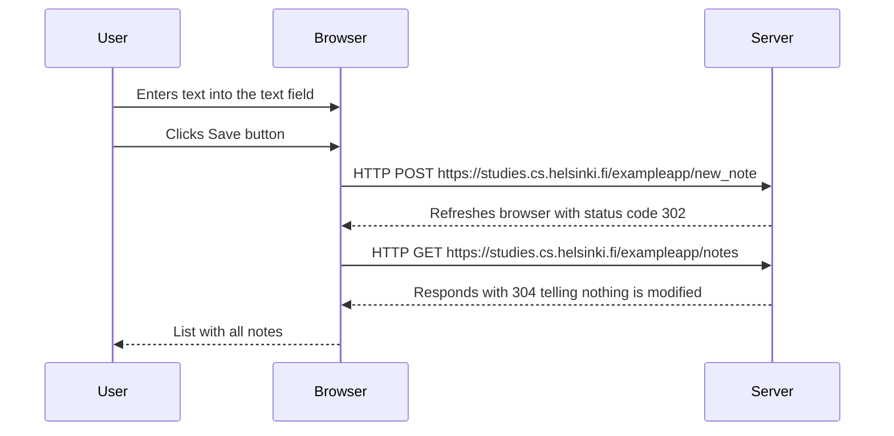

```mermaid
sequenceDiagram
    participant User
    participant Browser
    participant Server
    User->>Browser: Enters text into the text field
    User->>Browser: Clicks Save button
    Browser->>Server: HTTP POST https://studies.cs.helsinki.fi/exampleapp/new_note
    Server-->>Browser: Refreshes browser with status code 302
    Browser->>Server: HTTP GET https://studies.cs.helsinki.fi/exampleapp/notes
    Server-->>Browser: Responds with 304 telling nothing is modified
    Browser-->>User: List with all notes
```
