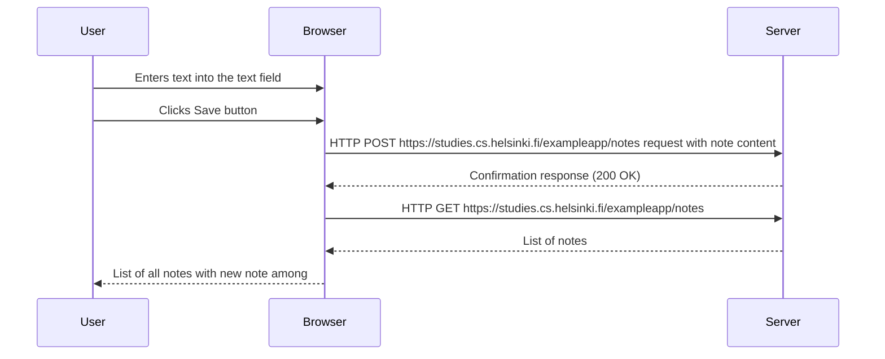

```mermaid
sequenceDiagram
    participant User
    participant Browser
    participant Server
    User->>Browser: Enters text into the text field
    User->>Browser: Clicks Save button
    Browser->>Server: HTTP POST https://studies.cs.helsinki.fi/exampleapp/notes request with note content
    Server-->>Browser: Confirmation response (200 OK)
    Browser->>Server: HTTP GET https://studies.cs.helsinki.fi/exampleapp/notes
    Server-->>Browser: List of notes
    Browser-->>User: List of all notes with new note among
```
