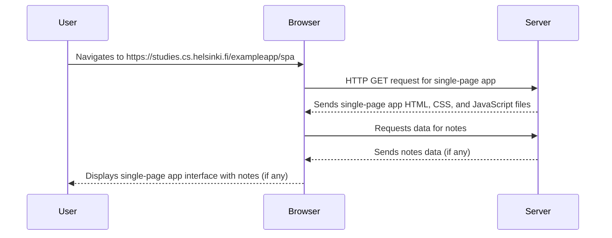

```mermaid
sequenceDiagram
    participant User
    participant Browser
    participant Server
    User->>Browser: Navigates to https://studies.cs.helsinki.fi/exampleapp/spa
    Browser->>Server: HTTP GET request for single-page app
    Server-->>Browser: Sends single-page app HTML, CSS, and JavaScript files
    Browser->>Server: Requests data for notes
    Server-->>Browser: Sends notes data (if any)
    Browser-->>User: Displays single-page app interface with notes (if any)

```
